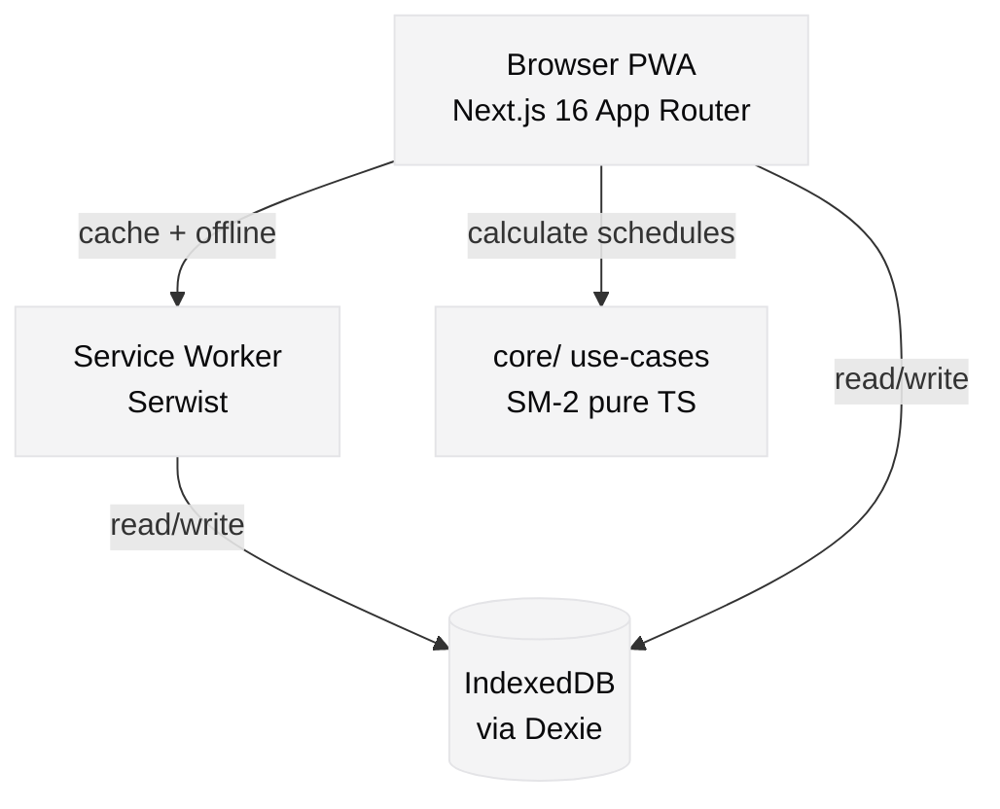
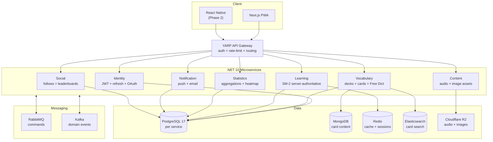

# System architecture — Lexio

> Current prototype state + target production architecture. Source of truth: doc §6.

## Current state — prototype FE-only (phase 1)

All logic runs in the browser. No network calls to backend services. Dexie/IndexedDB is the persistence layer.



### Layer responsibilities

| Layer    | Path           | Responsibility                                       |
| -------- | -------------- | ---------------------------------------------------- |
| Pages    | `app/(app)/`   | Route + RSC shell; delegates to feature components   |
| Features | `features/`    | Vertical slices — UI + hooks + stores                |
| Core     | `core/`        | Pure TS domain — entities, ports, use-cases, schemas |
| Lib      | `lib/storage/` | Dexie adapters implementing `core/ports/` interfaces |
| Shared   | `shared/`      | UI primitives, icons, fonts, cross-cutting hooks     |

### Dependency rule (enforced by eslint-plugin-boundaries)

```
app → features → lib → core
         ↓
       shared
         ↓
       core
```

`core/` has zero outward dependencies. `features/` never import each other. Violations fail CI.

### Data flow — study session

```
User rates card
  → features/learning/use-cases/submit-review.ts
  → core/use-cases/srs/calculate-next-review.ts   (pure TS, no I/O)
  → lib/storage/user-card-repository-dexie.ts      (write to IndexedDB)
  → core/use-cases/gamification/compute-xp.ts      (XP delta)
  → lib/storage/user-xp-repository-dexie.ts        (write XP)
  → TanStack Query invalidation → React re-render
```

## Target architecture — production (.NET 10 microservices)

Target per doc §6. Seven services on Kubernetes, YARP gateway, event-driven messaging.



### Service catalog (doc §6.3)

| Service      | Stack                  | Primary store        | Key responsibilities                                      |
| ------------ | ---------------------- | -------------------- | --------------------------------------------------------- |
| Identity     | .NET 10 + ASP.NET Core | PostgreSQL           | JWT issue/refresh, OAuth Google/GitHub, user profile      |
| Vocabulary   | .NET 10                | PostgreSQL + MongoDB | Deck/card CRUD, Free Dictionary integration, card search  |
| Learning     | .NET 10                | PostgreSQL + Redis   | SM-2 server-authoritative, session management, scheduling |
| Statistics   | .NET 10                | PostgreSQL           | Streak, XP, heatmap aggregations, leaderboard data        |
| Content      | .NET 10                | Cloudflare R2        | Audio pronunciation assets, card images, CDN routing      |
| Notification | .NET 10                | PostgreSQL           | Web push delivery (real), email, in-app toasts            |
| Social       | .NET 10                | PostgreSQL           | Follows, shared decks, activity feed, leaderboards        |

### Infrastructure components

| Component               | Choice                        | Purpose                                            |
| ----------------------- | ----------------------------- | -------------------------------------------------- |
| API Gateway             | YARP (.NET 10)                | Reverse proxy, JWT validation, rate limiting       |
| Message bus (commands)  | RabbitMQ                      | Request/reply between services                     |
| Event bus               | Kafka                         | Domain events (card-reviewed, streak-updated…)     |
| Cache                   | Redis 7                       | Session store, due-card cache, rate limit counters |
| Search                  | Elasticsearch                 | Card full-text search, vocabulary suggestions      |
| Object store            | Cloudflare R2                 | Audio + images, no egress fees                     |
| Container orchestration | Kubernetes                    | Per-service deployments, autoscaling               |
| Observability           | OpenTelemetry → Grafana stack | Traces, metrics, logs                              |

## Migration path — prototype to production

### Phase A — Identity service (v0.2)

1. Scaffold `services/identity/` — .NET 10, ASP.NET Core minimal API
2. Implement JWT issue + refresh per doc §6.7.2
3. Replace `features/auth/store/auth-store.ts` stub with HTTP client calls
4. Add refresh-token interceptor in `lib/api/`
5. Gate all `core/ports/auth-service.ts` implementations on real tokens

### Phase B — Vocabulary + Learning services (v0.3–v0.4)

1. Scaffold `services/vocabulary/` — deck/card CRUD + Free Dictionary integration
2. Scaffold `services/learning/` — port SM-2 algorithm from `core/use-cases/srs/` to C#
3. Replace `lib/storage/*-repository-dexie.ts` with HTTP repository adapters
4. Keep `core/ports/` interfaces unchanged — only adapters swap
5. Dexie stays as offline cache layer; sync on reconnect

### Phase C — Remaining services (v0.5–v0.6)

Statistics, Notification (real push), Social, Content per roadmap §10.

## Security notes

- CSP headers set in `next.config.ts` (production build) — `script-src`, `style-src`, `connect-src`
- Auth stub explicitly marked `NOT PRODUCTION` in UI banner and dev console
- VAPID keys are stubs — real push requires server-side key management
- No secrets in client bundle — `.env.example` has only placeholder values
- eslint-plugin-boundaries prevents accidental cross-layer data leakage paths
